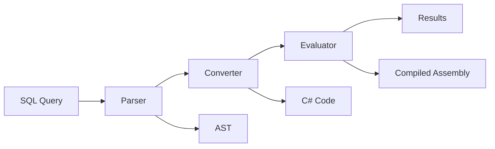

# Musoq: SQL Query Engine for Everything - AI Agent Documentation

## Table of Contents

1. [Quick Start](#quick-start)
2. [Architecture Overview](#architecture-overview)
3. [Core Components](#core-components)
4. [Plugin Development](#plugin-development)
5. [Query Processing Pipeline](#query-processing-pipeline)
6. [Development Workflow](#development-workflow)
7. [API Usage Patterns](#api-usage-patterns)
8. [Testing Strategies](#testing-strategies)
9. [Build and Deployment](#build-and-deployment)
10. [Troubleshooting Guide](#troubleshooting-guide)
11. [Key Files Reference](#key-files-reference)

## Quick Start

Musoq is a SQL-like query engine that can query diverse data sources without requiring a traditional database. It transforms SQL queries into executable C# code through a sophisticated compilation pipeline.

### Essential Understanding



### Quick Test Commands

```bash
# Build the solution
dotnet build

# Run all tests
dotnet test

# Run specific test project
dotnet test Musoq.Parser.Tests

# Run with specific filter
dotnet test --filter "TestCategory=Integration"
```

## Architecture Overview

### High-Level Architecture

Musoq follows a pipeline architecture with clear separation of concerns:

1. **Parser** (`Musoq.Parser`) - Lexical analysis and AST generation
2. **Schema** (`Musoq.Schema`) - Data source abstraction and type system
3. **Converter** (`Musoq.Converter`) - AST to C# code transformation
4. **Evaluator** (`Musoq.Evaluator`) - Dynamic compilation and execution
5. **Plugins** (`Musoq.Plugins`) - Extensible function library and data sources

### Data Flow

```
SQL Text → Lexer → Tokens → Parser → AST → Converter → C# Code → Compiler → Assembly → Executor → Results
```

### Key Design Principles

- **Extensibility First**: Plugin-based architecture for data sources
- **Performance Focus**: Dynamic compilation for optimal execution
- **Type Safety**: Strong typing throughout the pipeline
- **SQL Compatibility**: Standard SQL syntax with extensions

## Core Components

### 1. Parser Module (`Musoq.Parser`)

**Purpose**: Transforms SQL text into Abstract Syntax Tree (AST)

**Key Files**:
- `Parser.cs` - Main parsing logic with precedence handling
- `Lexing/Lexer.cs` - Tokenization and lexical analysis
- `Nodes/` - AST node hierarchy
- `Tokens/` - Token definitions

**Key Concepts**:
```csharp
// Entry point for parsing
var parser = new Parser(lexer);
var rootNode = parser.ComposeAll();
```

**AST Node Types**:
- `SelectNode` - SELECT clauses
- `FromNode` - FROM clauses and data sources
- `WhereNode` - WHERE conditions
- `OrderByNode` - ORDER BY clauses
- `GroupByNode` - GROUP BY clauses

### 2. Schema System (`Musoq.Schema`)

**Purpose**: Defines data source contracts and metadata management

**Key Files**:
- `ISchema.cs` - Main schema interface for plugins
- `DataSources/SchemaBase.cs` - Base class for schema implementations
- `DataSources/RowSource.cs` - Data iteration abstraction
- `RuntimeContext.cs` - Query execution context

**Plugin Contract**:
```csharp
public interface ISchema
{
    string Name { get; }
    ISchemaTable GetTableByName(string name, RuntimeContext context, params object[] parameters);
    RowSource GetRowSource(string name, RuntimeContext context, params object[] parameters);
    bool TryResolveMethod(string method, Type[] parameters, Type entityType, out MethodInfo methodInfo);
}
```

**Data Source Implementation Pattern**:
```csharp
public class MySchema : SchemaBase
{
    public MySchema() : base("myschema", new MethodsAggregator()) 
    {
        AddSource<MyRowSource>("data");
    }
}
```

### 3. Converter Module (`Musoq.Converter`)

**Purpose**: Transforms AST into executable C# code

**Key Files**:
- `Build/BuildChain.cs` - Chain of responsibility pattern for transformations
- `Build/CreateTree.cs` - Initial AST processing
- `Build/TranformTree.cs` - Semantic transformations
- `Build/TurnQueryIntoRunnableCode.cs` - Final C# code generation

**Transformation Pipeline**:
1. **CreateTree**: Initial AST processing and validation
2. **TranformTree**: Apply semantic transformations and optimizations
3. **TurnQueryIntoRunnableCode**: Generate executable C# code

### 4. Evaluator Module (`Musoq.Evaluator`)

**Purpose**: Compiles and executes generated code

**Key Files**:
- `CompiledQuery.cs` - Executable query wrapper
- `IRunnable.cs` - Interface for executable queries
- `Tables/Table.cs` - Result set representation
- `Runtime/` - Runtime function library

**Execution Flow**:
```csharp
var compiledQuery = new CompiledQuery(runnable);
var results = compiledQuery.Run();
```

### 5. Plugin System (`Musoq.Plugins`)

**Purpose**: Extensible function library

**Key Files**:
- `Lib/LibraryBase*.cs` - Standard function implementations
- `Assembly.cs` - Assembly utilities
- `Attributes/` - Plugin metadata attributes

## Plugin Development

### Creating a Data Source Plugin

1. **Create Schema Class**:
```csharp
public class MyDataSchema : SchemaBase
{
    public MyDataSchema() : base("mydata", new MethodsAggregator())
    {
        AddSource<MyDataSource>("source");
        AddTable<MyDataTable>("table");
    }
}
```

2. **Implement Row Source**:
```csharp
public class MyDataSource : RowSourceBase<MyEntity>
{
    public MyDataSource(string connectionString, RuntimeContext context) 
        : base(context)
    {
        // Initialize data source
    }

    public override IEnumerable<MyEntity> GetRows(CancellationToken cancellationToken)
    {
        // Yield data rows
    }
}
```

3. **Define Entity Type**:
```csharp
public class MyEntity
{
    public string Name { get; set; }
    public int Value { get; set; }
    public DateTime CreatedAt { get; set; }
}
```

4. **Register Schema**:
```csharp
var provider = new SchemaProvider();
provider.RegisterSchema("mydata", new MyDataSchema());
```

### Function Library Extension

```csharp
public class MyLibrary : LibraryBase
{
    [BindableMethod]
    public string ProcessText(string input, string pattern)
    {
        // Custom function implementation
        return result;
    }
}
```

## Query Processing Pipeline

### 1. Lexical Analysis
```
"SELECT Name FROM @mydata.source('param')" → Tokens
```

### 2. Parsing
```
Tokens → AST (SelectNode + FromNode + ...)
```

### 3. Semantic Analysis
```
AST → Type Inference → Schema Resolution → Optimized AST
```

### 4. Code Generation
```csharp
// Generated C# code example
public class Query_12345 : IRunnable
{
    public Table Run(CancellationToken token)
    {
        var source = schema.GetRowSource("source", context, "param");
        var results = new List<object[]>();
        
        foreach(var row in source.GetRows(token))
        {
            results.Add(new object[] { row.Name });
        }
        
        return new Table(results);
    }
}
```

### 5. Compilation and Execution
```
C# Code → Dynamic Compilation → Assembly → Execution → Results
```

## Development Workflow

### Setting Up Development Environment

1. **Prerequisites**:
   - .NET 8.0 SDK
   - Visual Studio or VS Code
   - Git

2. **Clone and Build**:
```bash
git clone https://github.com/Puchaczov/Musoq.git
cd Musoq
dotnet restore
dotnet build
```

3. **Run Tests**:
```bash
dotnet test --verbosity normal
```

### Project Structure

```
Musoq/
├── Musoq.Parser/           # SQL parsing and AST generation
├── Musoq.Schema/           # Data source abstraction
├── Musoq.Converter/        # AST to C# transformation
├── Musoq.Evaluator/        # Code compilation and execution
├── Musoq.Plugins/          # Standard function library
├── *.Tests/                # Unit and integration tests
├── Musoq.Benchmarks/       # Performance benchmarks
└── docs/                   # Documentation
```

### Making Changes

1. **Component-Specific Changes**:
   - Parser: Modify lexing/parsing logic
   - Schema: Add new data source types
   - Converter: Modify code generation
   - Evaluator: Change execution behavior
   - Plugins: Add new functions

2. **Testing Strategy**:
   - Unit tests for individual components
   - Integration tests for query execution
   - Performance tests for optimization

3. **Build and Test Loop**:
```bash
# Make changes
dotnet build
dotnet test --filter "TestCategory=Unit"
dotnet test --filter "TestCategory=Integration"
```

## API Usage Patterns

### Basic Query Execution

```csharp
// Using test infrastructure pattern
var schemaProvider = new BasicSchemaProvider<MyEntity>(dataSources);
var compiledQuery = InstanceCreator.CompileForExecution(
    "SELECT Name, Value FROM @schema.table('param')",
    Guid.NewGuid().ToString(),
    schemaProvider,
    loggerResolver);

var results = compiledQuery.Run();
```

### Advanced Query with Multiple Sources

```csharp
var query = @"
    SELECT a.Name, b.Value 
    FROM @source1.data() a 
    INNER JOIN @source2.data() b ON a.Id = b.Id
    WHERE a.CreatedAt > '2023-01-01'
    ORDER BY a.Name";

var compiledQuery = InstanceCreator.CompileForExecution(query, ...);
var table = compiledQuery.Run();
```

### Custom Schema Registration

```csharp
var provider = new SchemaProvider();
provider.RegisterSchema("mydata", new MyDataSchema());
provider.RegisterSchema("files", new FileSystemSchema());

var compiledQuery = InstanceCreator.CompileForExecution(query, ...);
```

## Testing Strategies

### Unit Testing Pattern

```csharp
[TestClass]
public class MyFeatureTests : BasicEntityTestBase
{
    [TestMethod]
    public void Should_Parse_Complex_Query()
    {
        // Arrange
        var query = "SELECT Name FROM @test.data()";
        
        // Act
        var buildItems = CreateBuildItems<BasicEntity>(query);
        
        // Assert
        Assert.IsNotNull(buildItems);
        // Additional assertions
    }
}
```

### Integration Testing Pattern

```csharp
[TestMethod]
public void Should_Execute_Query_With_Results()
{
    // Arrange
    var data = new Dictionary<string, IEnumerable<BasicEntity>>
    {
        ["entities"] = new[] 
        { 
            new BasicEntity { Name = "Test", Value = 1 }
        }
    };
    
    // Act
    var vm = CreateAndRunVirtualMachine("SELECT Name FROM @basic.entities()", data);
    var table = vm.Run();
    
    // Assert
    Assert.AreEqual(1, table.Count);
    Assert.AreEqual("Test", table[0][0]);
}
```

### Test Data Setup

```csharp
protected static BasicEntity[] CreateBasicEntities()
{
    return new[]
    {
        new BasicEntity { Id = 1, Name = "Entity1", Value = 100 },
        new BasicEntity { Id = 2, Name = "Entity2", Value = 200 }
    };
}
```

## Build and Deployment

### Build Configuration

- **Target Framework**: .NET 8.0
- **C# Version**: Latest
- **NuGet Packages**: Managed via PackageReference

### Build Commands

```bash
# Clean build
dotnet clean
dotnet restore
dotnet build --configuration Release

# Pack NuGet packages
dotnet pack --configuration Release

# Run benchmarks
dotnet run --project Musoq.Benchmarks --configuration Release
```

### Project Dependencies

```
Musoq.Evaluator
├── Musoq.Converter
├── Musoq.Schema
├── Musoq.Parser
└── Musoq.Plugins

Musoq.Converter
├── Musoq.Schema
└── Musoq.Parser

Musoq.Schema
└── (Base dependencies only)

Musoq.Parser
└── (Base dependencies only)
```

### NuGet Publishing

Each component is published as a separate NuGet package:
- `Musoq.Parser` - SQL parsing library
- `Musoq.Schema` - Schema abstraction
- `Musoq.Converter` - Code generation
- `Musoq.Evaluator` - Query execution
- `Musoq.Plugins` - Standard functions

## Troubleshooting Guide

### Common Issues

1. **Parse Errors**:
   - Check SQL syntax
   - Verify token definitions in `Tokens/`
   - Debug lexer output

2. **Schema Resolution Failures**:
   - Verify schema registration
   - Check method signatures
   - Validate parameter types

3. **Compilation Errors**:
   - Review generated C# code
   - Check type inference
   - Validate method resolution

4. **Runtime Errors**:
   - Check data source connectivity
   - Validate parameter values
   - Review cancellation token usage

### Debugging Techniques

1. **AST Inspection**:
```csharp
var parser = new Parser(lexer);
var rootNode = parser.ComposeAll();
// Set breakpoint and inspect AST structure
```

2. **Generated Code Inspection**:
```csharp
var buildItems = InstanceCreator.CreateForAnalyze(query, ...);
// Inspect generated C# code in buildItems
```

3. **Query Execution Tracing**:
```csharp
var compiledQuery = InstanceCreator.CompileForExecution(query, ...);
// Enable logging to trace execution
var results = compiledQuery.Run();
```

### Performance Analysis

1. **Benchmark Tests**:
```bash
dotnet run --project Musoq.Benchmarks --configuration Release
```

2. **Memory Profiling**:
   - Use dotMemory or PerfView
   - Focus on row enumeration
   - Check for memory leaks in data sources

3. **Query Optimization**:
   - Review generated C# code
   - Optimize data source implementations
   - Consider parallel execution

## Key Files Reference

### Parser Module
- `Parser.cs` - Main parsing logic
- `Lexing/Lexer.cs` - Tokenization
- `Nodes/QueryNode.cs` - Base AST node
- `Tokens/TokenType.cs` - Token definitions

### Schema Module
- `ISchema.cs` - Plugin interface
- `DataSources/SchemaBase.cs` - Base implementation
- `DataSources/RowSource.cs` - Data iteration
- `RuntimeContext.cs` - Execution context

### Converter Module
- `Build/BuildChain.cs` - Transformation pipeline
- `Build/TurnQueryIntoRunnableCode.cs` - Code generation
- `InstanceCreator.cs` - Main API entry point

### Evaluator Module
- `CompiledQuery.cs` - Query execution
- `IRunnable.cs` - Execution interface
- `Tables/Table.cs` - Result representation

### Plugin Module
- `Lib/LibraryBase.cs` - Function base class
- `Assembly.cs` - Assembly utilities
- `Attributes/BindableMethodAttribute.cs` - Method binding

### Test Infrastructure
- `Musoq.Tests.Common/Culture.cs` - Test culture setup
- `Musoq.Evaluator.Tests/Schema/Basic/BasicEntityTestBase.cs` - Test base
- `Musoq.Evaluator.Tests/Components/` - Test utilities

---

This documentation provides a comprehensive guide for AI agents working with the Musoq codebase. It covers architecture, development patterns, testing strategies, and practical examples for understanding and extending the query engine.