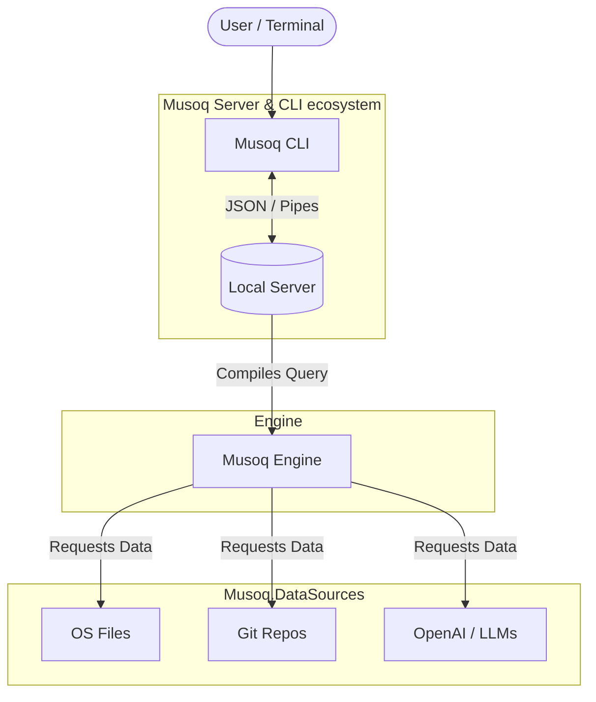
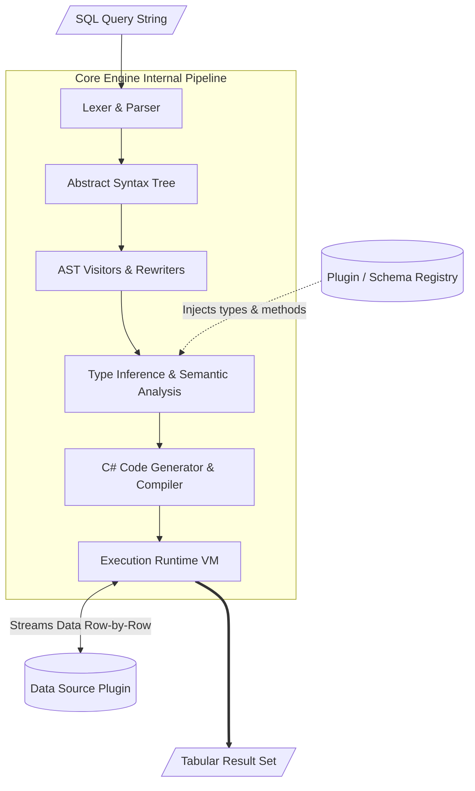

<!-- 
(Best practice: if you have a logo, place it here centered)
<p align="center">
  
</p> 
-->

```text
  ███╗   ███╗██╗   ██╗███████╗ ██████╗  ██████╗ 
  ████╗ ████║██║   ██║██╔════╝██╔═══██╗██╔═══██╗
  ██╔████╔██║██║   ██║███████╗██║   ██║██║   ██║
  ██║╚██╔╝██║██║   ██║╚════██║██║   ██║██║▄▄ ██║
  ██║ ╚═╝ ██║╚██████╔╝███████║╚██████╔╝╚██████╔╝
  ╚═╝     ╚═╝ ╚═════╝ ╚══════╝ ╚═════╝  ╚══▀▀═╝ 
        SQL Superpowers for Developers
```

# Musoq: SQL Superpowers for Developers

[](https://opensource.org/licenses/MIT)
[](https://github.com/Puchaczov/Musoq/graphs/code-frequency)
[](https://www.nuget.org/packages?q=musoq)


**Ad-hoc SQL queries against files, logs, processes, and more — with zero data ingestion or intermediate storage.**

<p align="center">
  
</p>

Musoq is built for **ad-hoc querying and investigation** — the moments when you want to ask a quick question about data that isn't already in a database: a log file, a git history, a binary dump, a CSV, a running process. The kind of question where writing a script feels like too much overhead, but `grep` alone isn't enough.

Instead of a script, you write a query.

*Musoq extends standard SQL with declarative inline **text parsing**, **binary decoding**, and cross-source data joins — defined directly inside the query.*

📚 **[Read the Full Documentation](https://github.com/Puchaczov/Musoq/wiki)** *(Or run `Musoq --help` in your terminal)*

## Table of Contents

- [The Motivation: Bash vs. SQL](#-the-motivation-bash-vs-sql)
- [Quick Start & Installation](#-quick-start--installation)
- [Beyond Standard SQL](#-beyond-standard-sql)
  - [Inline Binary Decoding](#1-inline-binary-decoding)
  - [Declarative Text Log Parsing](#2-declarative-text-log-parsing)
  - [Strong Typing for Dynamic Data](#3-strong-typing-for-dynamic-data-table--couple)
- [The Developer Toolbox](#-the-developer-toolbox-beyond-ad-hoc-queries)
- [How Musoq Fits in the Ecosystem](#-how-does-musoq-fit-into-the-sql-tooling-ecosystem)
- [A Universe of Data Sources](#-available-data-sources)
- [Ecosystem Architecture](#-the-musoq-ecosystem)

---

## 💡 The Motivation: Bash vs. SQL

Instead of maintaining a fragile chain of Bash commands:
```bash
find . -name "*.js" -exec wc -l {} \; | awk '{sum+=$1} END {print sum}'
```

Write declarative, readable SQL:
```sql
select Sum(Length(f.GetFileContent())) as TotalLines
from os.files('.', true) f
where f.Extension = '.js'
```

---

## 🚀 Quick Start & Installation

To actually execute Musoq queries locally, you need the CLI application. Since Musoq by itself is just the engine, the CLI and Server handles compiling your query and returning formatted results (in tables, JSON, CSV, Yaml, etc.).

### 1. Install CLI
*(no additional dependencies required)*

**Powershell (Windows)**
```powershell
irm https://raw.githubusercontent.com/Puchaczov/Musoq.CLI/refs/heads/main/scripts/powershell/install.ps1 | iex
```

**Shell using curl (Linux / macOS)**
```shell
curl -fsSL https://raw.githubusercontent.com/Puchaczov/Musoq.CLI/refs/heads/main/scripts/bash/install.sh | sudo bash
```

*(Prefer a manual install? Download the standalone binary from our [Releases](https://github.com/Puchaczov/Musoq.CLI/releases) page.)*

### 2. Install Data Sources
Musoq is highly modular. You install data sources via the built-in registry to unlock new tables and schemas.

```bash
Musoq datasource install os --registry
Musoq datasource install git --registry
Musoq datasource install separatedvalues --registry
```

### 3. Run your first queries
Open a terminal, start a background server, and fire away!
```bash
# 1. Start the local agent server
Musoq serve

# 2. Who is consuming all the space?
Musoq run "select Name, Length from os.files('/home', true) order by Length desc take 10"

# 3. Look at recent commits
Musoq run "select c.Sha, c.Message, c.Author from git.repository('.') r cross apply r.Commits c"

# 4. Stop the server when done
Musoq quit
```

---

## ✨ Beyond Standard SQL

Musoq doesn't just read tables; it **understands raw data formats inline**. You don't need a custom plugin to query weird file formats if you can describe them.

*Querying standard CSVs and JSON is easy, but Musoq's real power is understanding raw data formats...*

### 1. Inline Binary Decoding (`binary` schemas)
Reading a custom binary file usually means opening a hex editor or writing a C# `BinaryReader` wrapper. With Musoq, you declare the binary layout right above your query:

```sql
-- Declare your binary struct right in the script!
binary GameSaveHeader {
    Magic:    int le,
    Version:  short le,
    PlayerId: byte[16],
    Score:    int le
}

-- Query the raw bytes from the file using the declaration
select 
    h.Version, 
    ToHex(h.PlayerId) as UID, 
    h.Score 
from os.file('/saves/save1.dat') f
cross apply Interpret(f.GetBytes(), GameSaveHeader) h
where h.Magic = 0x4D414745 -- 'GAME'
```

### 2. Declarative Text Log Parsing (`text` schemas)
Parsing a badly formatted application log without Musoq usually means chaining regex patterns that are hard to read and harder to maintain. Musoq lets you describe the structure inline instead:

```sql
-- Describe what the log looks like inline
text LogEntry {
    Timestamp: between '[' ']',
    _:         literal ' ',
    Level:     until ':',
    _:         literal ': ',
    Message:   rest
}

-- Stream it, parse it, query it!
select log.Timestamp, log.Level, log.Message
from os.file('/var/logs/app.log') f
cross apply Lines(f.GetContent()) line
cross apply Parse(line.Value, LogEntry) log
where log.Level = 'ERROR'
```

### 3. Strong Typing for Dynamic Data (`table` & `couple`)
CSV, JSON, and LLMs often return untyped string data. Musoq lets you define strong types and "couple" them with dynamic datasources to enforce sanity:

```sql
table Receipt {
    Shop: string,
    ProductName: string,
    Price: decimal
};

-- Bind untyped AI-vision extraction output to strict SQL Types
couple stdin.LlmExtractFromImage() with table Receipt as SourceOfReceipts;

select s.Shop, s.ProductName, s.Price 
from SourceOfReceipts('OpenAi', 'gpt-4o') s
where s.Price > 100.00
```

---

## 🧰 The Developer Toolbox: Supporting Ad-Hoc Workflows

The CLI is designed around the ad-hoc investigation workflow — quickly reaching for data, shaping it, and moving on. Beyond one-liners, it also supports saving frequent queries as tools and exposing them to AI agents.

### 1. First-Class `stdin` Piping
You don't always want to query files on disk. Musoq has native support for intercepting streamed `stdin` data and structuring it on the fly using zero-copy memory-mapped buffers:

```bash
# Query JSON output from other CLI tools instantly
kubectl get pods -o json | musoq run "select * from stdin.JsonFlat() where path like '%status.phase' and value = 'Running'"

# Apply regex directly to a live command stream
cat app.log | musoq run "select * from stdin.Regex('(?<timestamp>.*?)\\s+(?<level>.*?)\\s+(?<message>.*)') where level = 'ERROR'"
```

### 2. Parameterized Tools
Instead of retyping complex queries, you can save them as **Tools** using YAML and Scriban templates. 

```bash
# Execute a saved tool with dynamic arguments
Musoq tool execute search_commits --author "John Doe" --since "2024-01-01"
```

### 3. Native Model Context Protocol (MCP) Server
By enabling the built-in MCP server (`musoq set mcp-enabled true`), Musoq exposes your parameterized tools as callable functions to AI agents like Claude, Cursor, or GitHub Copilot. 

You can create isolated "Contexts" so your AI assistant can safely query your active git history, search local file hierarchies, or parse your API responses using SQL, without writing any integration code.

---

## 🆚 How does Musoq fit into the SQL tooling ecosystem?

There are several excellent tools that allow you to use SQL outside of traditional databases. While they share a similar syntax, they are fundamentally designed to solve different classes of problems:

| Tool | Primary Focus | Best Suited For |
|---|---|---|
| **DuckDB** | Analytical Workloads (OLAP) | Aggregating and analyzing large, structured datasets (Parquet, CSV, JSON) at extremely high speeds. |
| **Steampipe** | Cloud Infrastructure | Querying cloud APIs (AWS, Azure, GitHub) as foreign tables for compliance, auditing, and DevSecOps. |
| **osquery** | Endpoint Monitoring | Tracking the state, metrics, and security configurations across fleets of operating systems. |
| **Musoq** | Ad-hoc Querying & Investigation | One-off queries, debugging sessions, and local investigations against files, logs, binary data, and `stdin` — without importing or storing anything. |

While tools like DuckDB and Steampipe excel when data is already naturally structured or API-driven, Musoq is built for the investigative, exploratory side of development — when you don't know the shape of the data yet and you want to ask questions first. It gives you the primitives (inline `text` matchers, `binary` schemas, and AI `couple` statements) to define structure *during* the query, not before it.

Importantly, **Musoq does not use an underlying database engine** (like SQLite or Postgres FDWs). There is no "import" step, no data ingestion, and no intermediate storage. Musoq is a pure runtime that streams and transforms data exactly where it resides—whether that's a file on disk, an API response, or `stdin`—and outputs the result directly.

---

## 🔌 Available Data Sources

You can query APIs, files, and services as logical tables using our growing library of [Musoq Data Sources](https://github.com/Puchaczov/Musoq.DataSources):

- **Development**: C# Code Analysis (Roslyn), Git (tags, diffs, line history)
- **Infrastructure**: Docker (containers, images, logs), Kubernetes, System OS
- **Files**: JSON, CSV, Archives (Zip/Tar), Flat files
- **AI & Integrations**: OpenAI/Ollama (Unstructured extractions!), Airtable, CANBus
- **Databases**: Postgres, SQLite

*(Tip: Just run `desc schema` or `desc schema.table(args)` inside Musoq to explore what is queryable.)*

---

## 🧩 The Musoq Ecosystem

Musoq is highly modular and built with extensibility at its core. Here is how the components interact:



It is divided into 3 key projects:

1. **[Musoq](https://github.com/Puchaczov/Musoq)** (You are here): The core MIT-licensed SQL engine language and AST runtime. Designed to be extended with new data sources.
2. **[Musoq.DataSources](https://github.com/Puchaczov/Musoq.DataSources)**: The MIT-licensed repository containing all the plugins (Git, OS, Postgres, OpenAI, Archives).
3. **[Musoq.CLI & Musoq.AgentLocal](https://github.com/Puchaczov/Musoq.CLI)**: A lightweight background server & CLI that executes the Musoq query language locally. Not yet open sourced, but free to use.

### Deep Dive: Engine Architecture

When a query enters the core **Musoq Engine**, it goes through the following pipeline:



## 🤖 Extensibility & AI-Driven Agent Plugins
You can write C# or Python plugins manually, or point an AI agent at the plugin development guide and have it build one for you.

We provide a dedicated, self-contained guide designed explicitly for Autonomous Coding Agents (like GitHub Copilot, Cursor, or Claude) to build, test, package, and deploy complete .NET plugins without human intervention. Just point your agent at the docs and tell it what data source you want!

Check out the [🤖 Autonomous Plugin Development Guide (in Musoq.DataSources)](https://github.com/Puchaczov/Musoq.DataSources/blob/main/MusoqAutonomousPluginDevelopment.md) to bootstrap your first AI-generated plugin.

---

*"Why write loops, when you can write queries?"*

---

## 📜 License

This project is licensed under the MIT License - see the [LICENSE](LICENSE) file for details. This means Musoq is free for both non-commercial and commercial use.
