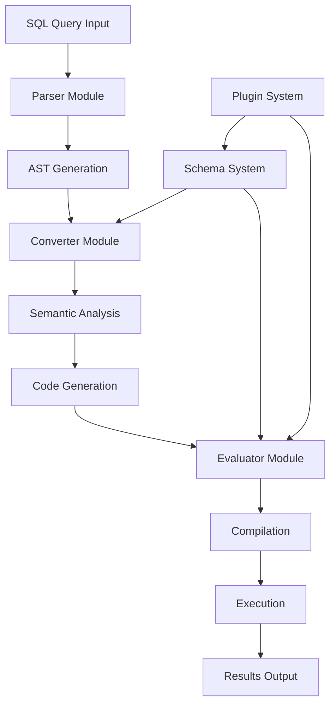

# Musoq Architecture Guide

This document provides a comprehensive overview of Musoq's architecture, designed for developers who want to understand the internal workings, extend functionality, or contribute to the project.

## Table of Contents

1. [Architecture Overview](#architecture-overview)
2. [Core Components](#core-components)
3. [Query Processing Pipeline](#query-processing-pipeline)
4. [Plugin System](#plugin-system)
5. [Implementation Details](#implementation-details)
6. [Extension Guide](#extension-guide)

## Architecture Overview

Musoq follows a layered architecture that transforms SQL queries into executable code through a multi-stage pipeline:



## Core Components

### Parser Module (`Musoq.Parser`)

The parser module is responsible for transforming SQL text into an Abstract Syntax Tree (AST).

#### Key Responsibilities:
- **Lexical Analysis**: Breaking SQL text into tokens
- **Syntax Analysis**: Building AST from token stream
- **Error Detection**: Identifying and reporting syntax errors
- **Extension Support**: Handling Musoq-specific SQL extensions

#### Architecture Pattern:
- **Recursive Descent Parser**: For predictable parsing behavior
- **Visitor Pattern**: For AST traversal and transformation
- **Token-based Processing**: Clean separation between lexing and parsing

#### Key Classes:

```csharp
// Main parser class
public class Parser
{
    public RootNode ComposeAll()           // Parse complete SQL statement
    public StatementNode ComposeStatement() // Parse individual statements
}

// Lexical analyzer
public class Lexer
{
    public Token Current()                 // Get current token
    public void Next()                     // Advance to next token
}

// AST node hierarchy
public abstract class Node
{
    public abstract void Accept(IExpressionVisitor visitor);
}
```

### Schema System (`Musoq.Schema`)

The schema system provides abstraction for different data sources and manages type information.

#### Key Responsibilities:
- **Data Source Abstraction**: Unified interface for diverse data sources
- **Type Management**: Handling type information and conversions
- **Method Resolution**: Finding appropriate methods for operations
- **Metadata Management**: Caching and managing schema information

#### Plugin Interface:

```csharp
public interface ISchema
{
    string Name { get; }
    
    // Get table metadata
    ISchemaTable GetTableByName(string name, RuntimeContext context, params object[] parameters);
    
    // Get data source
    RowSource GetRowSource(string name, RuntimeContext context, params object[] parameters);
    
    // Method resolution
    bool TryResolveMethod(string method, Type[] parameters, Type entityType, out MethodInfo methodInfo);
}
```

#### Data Flow Pattern:

```csharp
// Data source implementation pattern
public abstract class RowSource
{
    public abstract IEnumerable<IObjectResolver> Rows { get; }
}

public interface IObjectResolver
{
    object this[string name] { get; }
    object this[int index] { get; }
}
```

### Converter Module (`Musoq.Converter`)

The converter transforms the AST into executable C# code through a series of transformation passes.

#### Transformation Pipeline:

1. **CreateTree**: Initial AST processing and setup
2. **TransformTree**: Semantic analysis and optimization
3. **TurnQueryIntoRunnableCode**: Final C# code generation

#### Key Transformation Patterns:

```csharp
// Chain of responsibility for transformations
public abstract class BuildChain
{
    protected readonly BuildChain Successor;
    public abstract void Build(BuildItems items);
}

// Visitor pattern for AST traversal
public abstract class ExpressionVisitor
{
    public virtual void Visit(SelectNode node) { /* implementation */ }
    public virtual void Visit(FromNode node) { /* implementation */ }
    // ... other node types
}
```

### Evaluator Module (`Musoq.Evaluator`)

The evaluator compiles generated C# code and executes queries.

#### Key Components:

```csharp
// Compiled query wrapper
public class CompiledQuery
{
    public Table Run()                        // Execute query
    public Table Run(CancellationToken token) // Execute with cancellation
}

// Executable interface
public interface IRunnable
{
    Table Run(CancellationToken token);
}
```

## Query Processing Pipeline

### 1. Parsing Phase

```csharp
// Input: SQL string
var sql = "SELECT Name FROM #os.files('/path') WHERE Extension = '.txt'";

// Lexical analysis
var lexer = new Lexer(sql);
var parser = new Parser(lexer);

// Syntax analysis
var ast = parser.ComposeAll();
```

### 2. Semantic Analysis Phase

```csharp
// Type inference and schema resolution
var buildItems = new BuildItems(ast, schemaManager);

// Apply transformations
var createTree = new CreateTree(transformTree);
createTree.Build(buildItems);
```

### 3. Code Generation Phase

```csharp
// Transform AST to C# code
var codeGenerator = new ToCSharpRewriteTreeVisitor();
ast.Accept(codeGenerator);

var generatedCode = codeGenerator.ToString();
```

### 4. Compilation Phase

```csharp
// Compile generated C# code
var compilation = CSharpCompilation.Create(
    assemblyName: "DynamicQuery",
    syntaxTrees: new[] { CSharpSyntaxTree.ParseText(generatedCode) },
    references: references);

// Create executable
var assembly = compilation.Emit();
var runnableType = assembly.GetType("GeneratedQuery");
var runnable = (IRunnable)Activator.CreateInstance(runnableType);
```

### 5. Execution Phase

```csharp
// Execute query
var compiledQuery = new CompiledQuery(runnable);
var results = compiledQuery.Run();
```

## Plugin System

### Data Source Plugin Development

#### 1. Schema Implementation

```csharp
public class MyCustomSchema : SchemaBase
{
    public override string Name => "mycustom";

    public override ISchemaTable GetTableByName(string name, RuntimeContext context, params object[] parameters)
    {
        return name switch
        {
            "table1" => new MyTable1(parameters),
            "table2" => new MyTable2(parameters),
            _ => throw new UnknownTableException(name)
        };
    }

    public override RowSource GetRowSource(string name, RuntimeContext context, params object[] parameters)
    {
        return name switch
        {
            "table1" => new MyRowSource1(parameters),
            "table2" => new MyRowSource2(parameters),
            _ => throw new UnknownTableException(name)
        };
    }
}
```

#### 2. Row Source Implementation

```csharp
public class MyRowSource : RowSource
{
    private readonly string[] _parameters;

    public MyRowSource(params object[] parameters)
    {
        _parameters = parameters.Cast<string>().ToArray();
    }

    public override IEnumerable<IObjectResolver> Rows
    {
        get
        {
            // Implementation-specific data retrieval
            foreach (var dataItem in GetDataItems())
            {
                yield return new EntityResolver<MyDataItem>(dataItem, MySchemaMapping.Instance);
            }
        }
    }

    private IEnumerable<MyDataItem> GetDataItems()
    {
        // Custom data retrieval logic
        // Can be file reading, API calls, database queries, etc.
    }
}
```

#### 3. Entity Resolver

```csharp
public class MyDataItem
{
    public string Name { get; set; }
    public int Size { get; set; }
    public DateTime Modified { get; set; }
}

public class MySchemaMapping : ISchemaMapping
{
    public static readonly MySchemaMapping Instance = new();

    public ISchemaColumn[] GetColumns()
    {
        return new ISchemaColumn[]
        {
            new SchemaColumn("Name", typeof(string)),
            new SchemaColumn("Size", typeof(int)),
            new SchemaColumn("Modified", typeof(DateTime))
        };
    }
}
```

### Function Plugin Development

```csharp
// Custom function library
public class MyFunctionLibrary : LibraryBase
{
    [BindableMethod]
    public string FormatSize(long bytes)
    {
        string[] sizes = { "B", "KB", "MB", "GB", "TB" };
        double len = bytes;
        int order = 0;
        while (len >= 1024 && order < sizes.Length - 1)
        {
            order++;
            len = len / 1024;
        }
        return $"{len:0.##} {sizes[order]}";
    }

    [BindableMethod]
    public DateTime ParseCustomDate(string dateString, string format)
    {
        return DateTime.ParseExact(dateString, format, CultureInfo.InvariantCulture);
    }
}
```

## Implementation Details

### AST Node Structure

```csharp
// Base node class
public abstract class Node
{
    public abstract void Accept(IExpressionVisitor visitor);
    public abstract Type ReturnType { get; set; }
}

// Query structure nodes
public class SelectNode : Node
{
    public FieldNode[] Fields { get; set; }
    public FromNode From { get; set; }
    public WhereNode Where { get; set; }
    public GroupByNode GroupBy { get; set; }
    public HavingNode Having { get; set; }
    public OrderByNode OrderBy { get; set; }
}

// Expression nodes
public class FieldNode : Node
{
    public Node Expression { get; set; }
    public string Alias { get; set; }
}
```

### Code Generation Patterns

```csharp
// Generated code structure
public class GeneratedQuery : IRunnable
{
    public Table Run(CancellationToken token)
    {
        // Data source initialization
        var dataSource = GetDataSource();
        
        // Query execution pipeline
        var results = dataSource
            .Where(item => /* generated condition */)
            .Select(item => new
            {
                // generated projections
            })
            .GroupBy(/* generated grouping */)
            .OrderBy(/* generated ordering */);
            
        // Result materialization
        return new Table(results);
    }
}
```

### Error Handling Strategy

```csharp
// Custom exception hierarchy
public abstract class MusoqException : Exception
{
    protected MusoqException(string message) : base(message) { }
}

public class ParseException : MusoqException
{
    public int Position { get; }
    public string ExpectedToken { get; }
}

public class CompilationException : MusoqException
{
    public IEnumerable<string> CompilerErrors { get; }
}

public class SchemaException : MusoqException
{
    public string SchemaName { get; }
    public string TableName { get; }
}
```

## Extension Guide

### Adding New Data Sources

1. **Create Schema Class**
   ```csharp
   public class MySchema : SchemaBase
   {
       // Implementation
   }
   ```

2. **Implement Row Source**
   ```csharp
   public class MyRowSource : RowSource
   {
       // Data iteration logic
   }
   ```

3. **Define Entity Mapping**
   ```csharp
   public class MyEntityResolver : IObjectResolver
   {
       // Property access implementation
   }
   ```

4. **Register Schema**
   ```csharp
   schemaManager.RegisterSchema<MySchema>();
   ```

### Adding Custom Functions

1. **Create Function Library**
   ```csharp
   public class MyFunctions : LibraryBase
   {
       [BindableMethod]
       public ReturnType MyFunction(ParameterType param)
       {
           // Implementation
       }
   }
   ```

2. **Register Library**
   ```csharp
   runtimeContext.RegisterLibrary(new MyFunctions());
   ```

### Performance Optimization Tips

1. **Lazy Evaluation**: Use `yield return` in row sources
2. **Predicate Pushdown**: Implement WHERE clause optimization in data sources
3. **Connection Pooling**: Reuse expensive resources
4. **Memory Management**: Dispose resources properly
5. **Caching**: Cache expensive computations and metadata

### Testing Strategies

1. **Unit Tests**: Test individual components in isolation
2. **Integration Tests**: Test complete query processing pipeline
3. **Performance Tests**: Benchmark query execution times
4. **Plugin Tests**: Validate custom data sources and functions

This architecture guide provides the foundation for understanding and extending Musoq. The modular design enables developers to add new data sources, functions, and optimizations while maintaining system stability and performance.